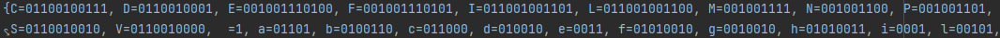
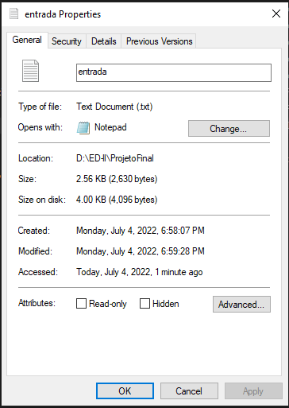
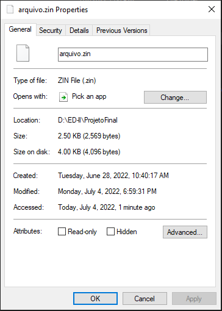
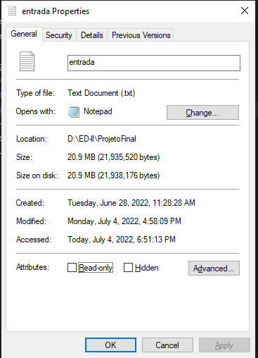
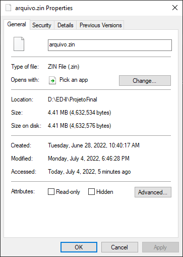

<style>
codigo{
    color: darkorange;
}
</style>
<h1>Algoritmo de Ruffman para a compactaçao de dados.</h1>

<h3>Linguagem ultilizada:</h3>

<p>Projeto implementado na linguagem java por conter muitas funcionalidades de manipulação de strings e vetores.</p>

<h3>Introdução:</h3>
<p>O trabalho de implementação se trata de pesquisar e buscar uma solução de compactação de dados usando um algoritmo de
compactação chamado de código de Huffman, que ultiliza de uma árvore binária de busca e que guarda um caractere em seu nó
folha (todos os seus filhos apontam para null) e por meio de operações lógicas podemos recuperar tais letras em sua devida
ordem a partir da sua frequência, outras metas para o projeto e a leitura de um arquivo externo contendo um texto e compac
tá-lo para um arquivo chamado <i>arquivo.zin</i> (a extenção .zin é uma escolha a gosto, já que a extenção não possui influência
em como os dados estão disposto no arquivo e sim em como os dados vao ser escritos, como é o caso de imagens que se trocarmos a extenção
.jpeg para .png a imagem continua sendo a mesma, mas perde-se alguma propriedades de arquivos com aquela extenção) e
providenciar o caminho inverso que é descompactar e mostrar a informação original</p>

<h3>Dos conhecimentos iniciais:</h3>
<p>A escolha de Java como linguagem de implementação nos traz beneficios como por exemplo não ser necessário a implementação
de árvore usando ponteiros e sua implementação genérica de árvore já esta contida no package java.util mas para algo mais
<i>gourmet</i> optei por implementar manualmente (o que não é nada difícil com a orientação a objetos)</p>

<codigo>A classe No:</codigo>
```java
public class Huffman_Node{
    //Caso seja folha possuirá um Caracatere
    private Character caractere;
    //numero obtido pela soma das frequencias - prioridade
    private int frequencia ;
    //filhos da direita e esquerda que por padrão sao iniciados com null
    private Huffman_Node direita = null , esquerdo = null;
}
```
<codigo>A classe Arvore:</codigo>
````java
public class Arvore{
    //possui apenas o no raiz como ponto de inicio da arvore
    private Huffman_Node raiz;
}
````

<h3>Principios básicos</h3>
<p>Os fundamentos da compressão usando o algoritmo de Huffman são de que usando uma lógica matemática para mapear os caracteres
em uma árvore binária usando 0's e 1's economizando bits ultilizando os bits do mapeamento para representar um caractere
equivalente de acordo com a linguagem e a tabela ascii usada, segue a tabela de tipos e seus tamanho na linguagem java:</p>

<div style="text-align: center ; align-content: center">
<table>
    <tbody>
        <tr>
            <th>tipo</th>
            <th>tamanho (bits)</th>
            <th>OBS</th>
        </tr>
        <tr>
            <td><codigo>int</codigo></td>
            <td>32</td>
            <td>pode guardar numeros desde -2,147,483,648 a 2,147,483,647</td>
        </tr>
        <tr>
            <td><codigo>char</codigo></td>
            <td>16</td>
            <td>Guarda um caractere simples segundo a tabela ascii</td>
        </tr>
        <tr>
            <td><codigo>byte</codigo></td>
            <td>8</td>
            <td>Medida comercial padrão pela indústria que suporta valos de -127 a 127</td>
        </tr>
    </tbody>
</table>
</div>
<h3>Da compactação:</h3>
<p>
    Tendo essas informações sabemos que podemos ter um arquivo menor usando representações de caracteres, melhor dizendo,
para cada <i>string</i> binária de caracteres podemos adotar um caractere que represente essa string como no exemplo a baixo:
</p>

````
    caractere a = 1010              A soma do total de bits usados para as 4 letras são 16 bits
    caractere b = 1011              logo podemos concaternar essa string binária e converte-la
    caractere c = 1100              na string 1010101111001101 que se inserida dentro de uma va-
    caractere d = 1101              riável do tipo char em java pode ser o caracter '孊'
````
<p>
    <i>Claro que a concatenação de códigos das letras podem ultrapassar os limites de bits da variável o que não tem nen
hum problema, basta partimos para a próximo caracter da <i>string</i> com o que faltou na anterior, e isso não gerará erros por
que o código de cada caracter na tabela necessáriamente nos leva a algum caractere na árvore, assim sabemos que o código 
da letra se encerrou quando atingirmos uma letra (atingirmos um nó folha na árvore)</i>
</p>

<p>Usando este método conseguimos reduzir o tamanho do arquivo usando uma função de logaritmo que é  logx (16) em que a 
base (x) é a media da quantidade de bits necessárias para mapear cada caracter, como por exemplo se a quantidade seja 4 
conseguimos mostrar que para cada 1 caractere original do arquivo podemos usar 1/4 de um caracter para representá-lo obt
endo uma média exagerada de 75% ( 3/4 ) de compactação para arquivos de texto.</p>
<p>mas não basta somente escrever o texto de forma compactada temos que adicionar ao arquivo formas de como traze-lo de
volta ao estado incial usamos entao a notação <codigo>toString</codigo> do java que já nos fornece essa função por padrão
e no arquivo final podemos ter uma escrita parecida com: </p>

<h3>Da descompactação</h3>
<p>Algo que temos que pensar é em como trazer esses dados de volta, pois bem ae que entra mais uma das vantagens da linguagem java
usando um tipo de dado chamado de <codigo>Map</codigo> esse tipo de dado tem uma peculiaridade excelente para o nosso pro
pósito que é: para cada informação inserida, se insere uma chave tal como em um banco de dados e como se pode imaginar,
a string binária é única para cada caractere então basta que sigamos a comparar as <i>string</i> binárias com o primeiro <i>meet</i>
que ocorrer entre os caracteres e não terá erro sendo que suponto que:</p>

```
caracter 'a' possui código = 000 não existe caracter x que possui código = 0001 pois antes de atingir 0001 tera atingido 000, e 000 é folha!
```

<p>sabendo disto podemos apenas ler caractere por caractere em sua forma binária (0's e 1's) e escrevendo o texto de volta ao estado incial</p>
<h3>Considerações:</h3>
<p>temos que ter em mente que há um custo envolvido em adicionar o mapeamento dos caracteres ao arquivo final o que torna
arquivos pequenos talvez maior que o tamanho original ou muito proximos do original</p>
<div> </div>
<p> Mas quanto maior o arquivo de texto melhor! porque os caracteres se repetem e o custo para armazená-los compactados 
é menor que o custo em armazená-los de forma bruta:</p>
<div></div>